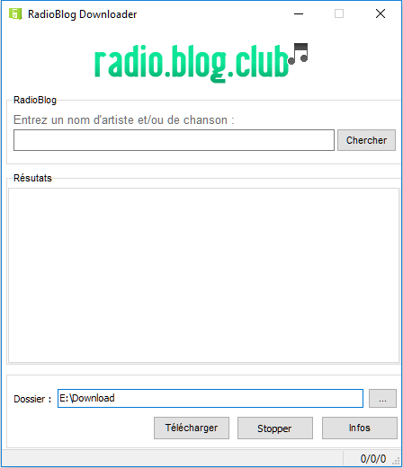

# RadioBlog Downloader

  <!-- Stability -->
  
  <!-- Standard -->
  

 

A tool to download music (mp3) from [radioblogclub.fr](http://www.radioblogclub.fr).

RadioBlogClub was closed in 2009 because it was not so legal ... :smirk:

The tool scraped the search result from the website and download the files.

Contrary to most methods to get the music files at that time (get the file from the Internet cache),
I found that adding a 16 bytes value in hexadecimal (MD5 hash ?) to the download URL is enough to download
the files directly. :grinning:

I'm probably not the only one to spot this value at that time ...

Here is the value :point_right: 657ecb3231ac0b275497d4d6f00b61a1 :flushed:

Date: around 2008

## Compilation

Compile the Ressources.rc file first by running "Compile Ressources.bat".

Then compile the project as usual.

## Example

  

